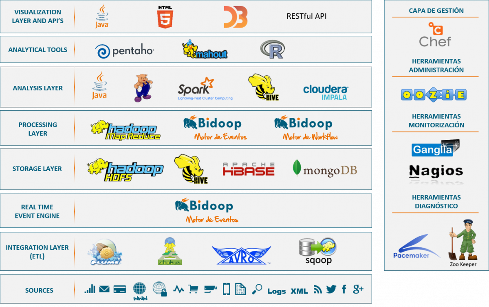

# BigData Ecosystem Architecture

## Internal working of Bigdata and it's ecosystems such as
- The background process related to resource allocation, database connection.
- How the data is distributed across the nodes.
- Execution life-cycle on submitting a Job.

** _Note: Refer the links metioned below under each ecosystem for detailed explanation_ **

## 1. HDFS :elephant:

The various underlying process that takes place during the storage of a file into HDFS such as:

- Type of scheduler

- Block & Rack information

- File size

- File location

- Replication information about the file(Over-replicated blocks, Under-replicated blocks, ...)

- Health status of the file

Please click on the link below to know the execution and flow process

## 2. SQOOP :octocat:

Used to perform 2 main operations.

- Sqoop Import: 
  - To ingest data from any source such as traditional databases into hadoop file system HDFS

- Sqoop Export: 
  - To export data from hadoop file system HDFS to any traditional databases

To support the above two operations internally a CodeGen is used.

- Sqoop CodeGen:

  -  To compile metadata and other relative information into java class file & create a Jar

Please click on the link below to know the execution and flow process

## 3. HIVE :honeybee:

It has mainly 4 components

- Hadoop core components(Hdfs, MapReduce)

- Metastore

- Driver

- Hive Clients

Please click on the link below to know the execution and flow process

:link: [Hive Architecture in Depth](https://www.linkedin.com/pulse/hive-architecture-indepth-jayvardhan-reddy-vanchireddy/)

## 4. SPARK :boom:

